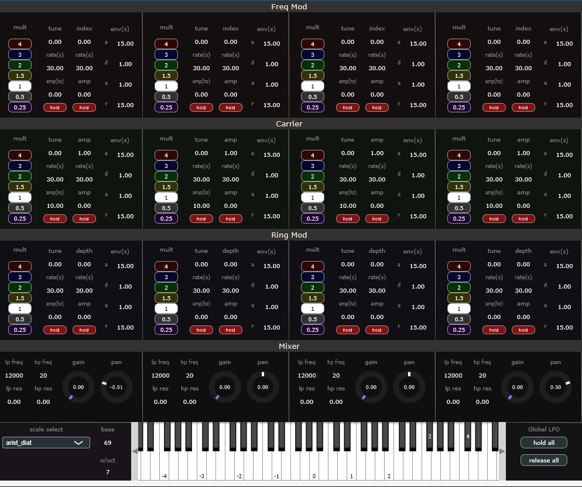
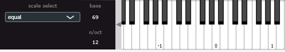
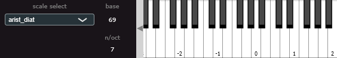
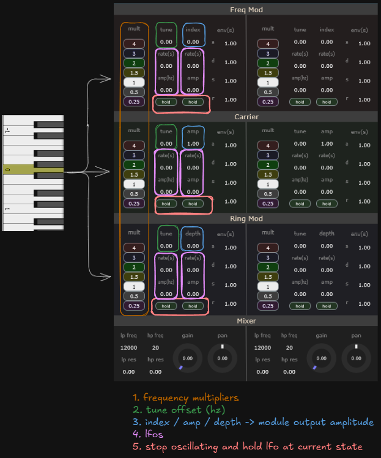

## PsychoPsinePsynth

Four tone, eight voice synth geared towards generating pycho-acoustic phenomena

### Prequisites

[JUCE Audio Framework](https://juce.com/get-juce/)

### Build

1. Open PsychoPsinePsynth.jucer 
2. Select the appropriate exporter. Visual Studio for Windows, Xcode for Mac. If projucer asks for you to include missing modules, just follow the instructions to do so.
3. Build in Release mode 
4. If using as a plugin copy the .vst3 or .component file from the project build folder and place them in the appropriate directory for your DAW
5. On windows that's typically ProgramFiles/CommonFiles/VST3
6. On a Mac it's usually Library/Audio/Plug-Ins/Components or /VST3

### Or download pre-built files
- [Windows](https://drive.google.com/drive/folders/1FUpKu5zBvb8kO84_Z-_Grzhf0BPuamoX?usp=sharing)
- [Mac](https://drive.google.com/drive/folders/1zueqCo491LqeqLv4Xb6ZXSGL5Nlr7NVv?usp=sharing)

### Usage

While PPP allows for standard equal temperment tunings, one of its defining features is the ability to work with several different tuning systems.
Use the dropdown to select the desired tuning. The keyboard updates to show where the octaves occur when the tuning does not have 12 notes/octave.

We refer to each column group (consisting of sub modules Freq Mod, Carrier and Ring Mod) as a tone

When a key is pressed:
1. the midi note is converted to the selected scale's frequency
2. that frequency is sent to each tone's Freq Mod, Carrier and Ring Mod 
3. the frequency is then altered / modulated independently in each unit in this order:
- (1) a frequency multiplier: transforms the pressed note up / down by octaves (0.25, 0.5, 1.0, 2.0, 4.0) or up by fifths (1.5, 3.0) 
- (2) a tune offset in hz
- (4) a tune lfo centered around the resulting frequency
- This is the same for Freq Mods, Carriers and Ring Mods

Additionally, each sub module has an index / amp / depth parameter (3) corresponding the amplitude of the signal provided by the module
- For the Freq Mod, this is the index. It controls the amplitudes of the overtones generated by the Freq Mod.
- For the Carrier, this is the output amplitude (volume) of the carrier signal.
- For the Ring Mod, this is Dry/Wet control with 1 = fully wet and 0 = dry
- In contrast to the tune lfo's, the lfo's associated with index / amp / depth have as their max value the index / depth /amp and are thus centered at index - (amp/2)

The mixer section provides high and low pass 24db ladder filters along with gain and pan control for each tone.

### Known issues

When used as a plugin, the latched on screen keyboard notes dissapear when the plugin window is closed and re-opened.

